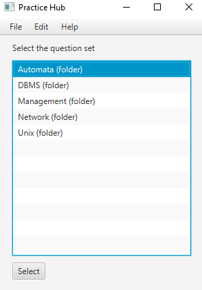
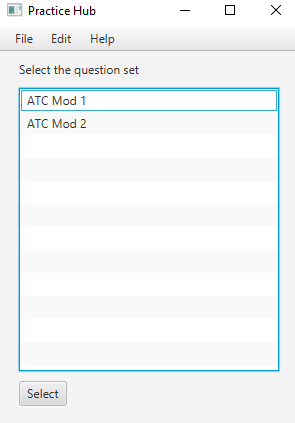
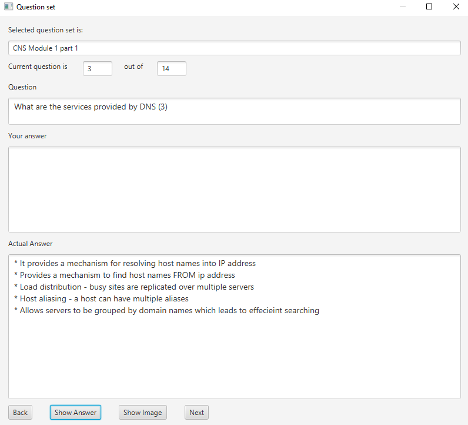
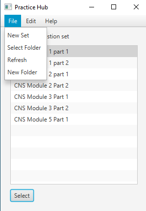
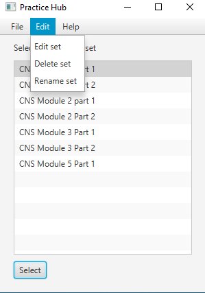
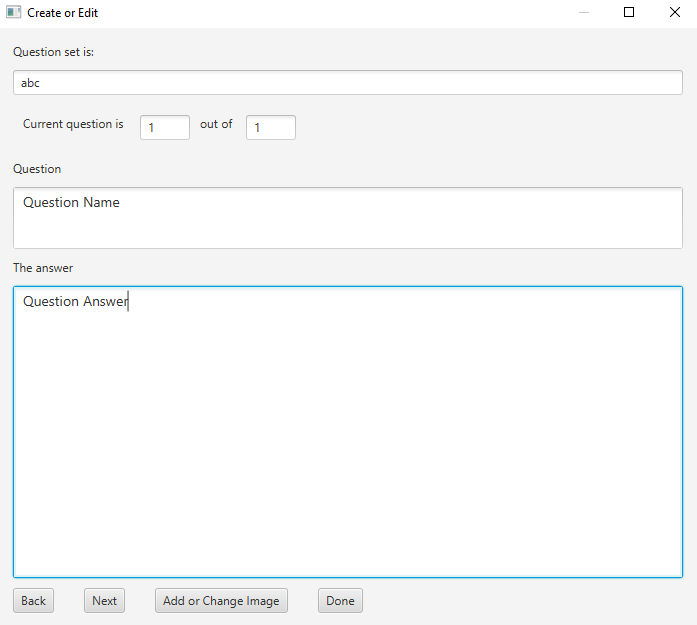

# Practice Hub 

## Overview 

This is an application made with JavaFX which allows you to create Question Sets to help you study.

Question sets consist of a number of question and answer pairs, along with an optional image for
each question (for answers which require a diagram).

They are stored in an XML File in a specified directory which will be accessed by the application.
The XML file contains question answer pairs indicated by the main `<question>` tag. 
The question text is stored inside the `<qinfo>` tag, and the answer text is stored inside the `<answer>` tag.
The path of the image is stored inside the `<image>` tag.

## Features 

On startup, you can see the Question Sets which you have created. 
Any folder is marked by the `(folder)` tag at the end of the folder name.

  

On selecting a question set, you can answer it by typing in your answer in the `Your Answer` box, 
and checking if its correct by clicking on the `Show Answer` button.

In the menubar, there are options for creating new question sets or folders.
You can also edit, rename, or delete question sets.

 

This is an example of creating a new question set. 
You can select an image by clicking on the `Add or Change Image` button.

The same window will pop up if you choose to edit a set.

